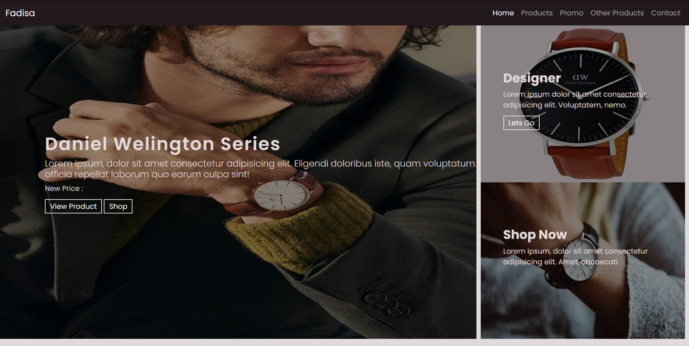
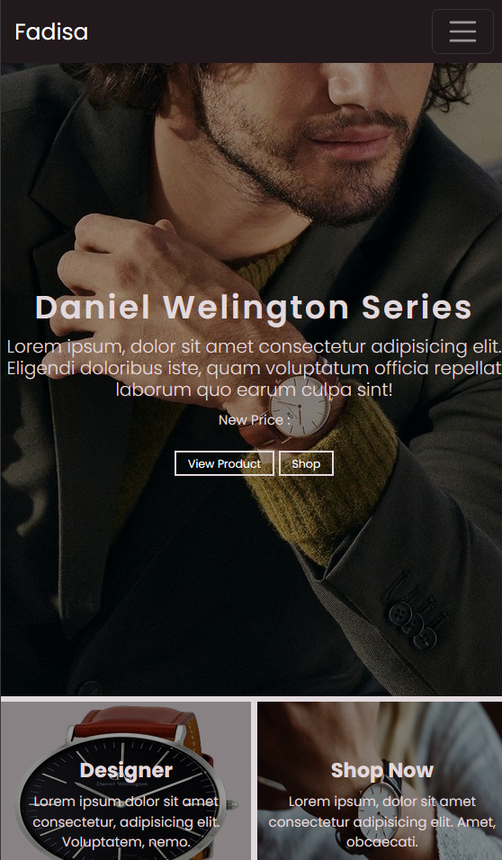
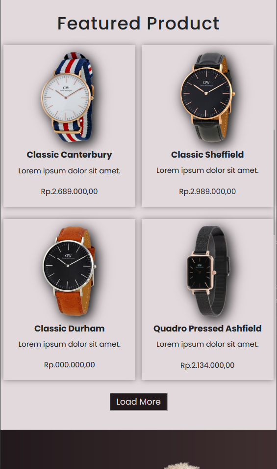
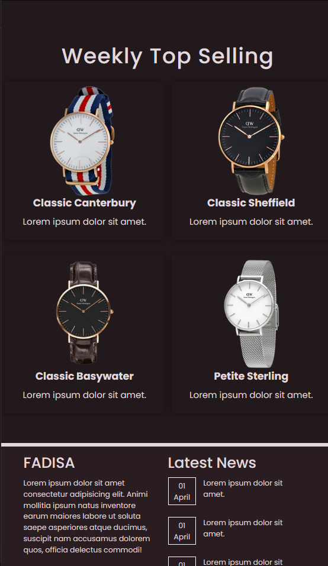

# Nama Proyek
UI Toko Jam Tangan

## 📸 Tampilan Proyek
- 

## 📸 Tampilan Proyek
- 

- 

- 

- 

## 🛠️ Teknologi yang Digunakan
- **Frontend**: HTML, CSS, JavaScript  

## 🚀 Cara Menjalankan Proyek
1. **Clone Repository**
   ```sh
   git clone https://github.com/USERNAME/REPO_NAME.git

✨ Kontributor
- Faizal Dwi Saputra
